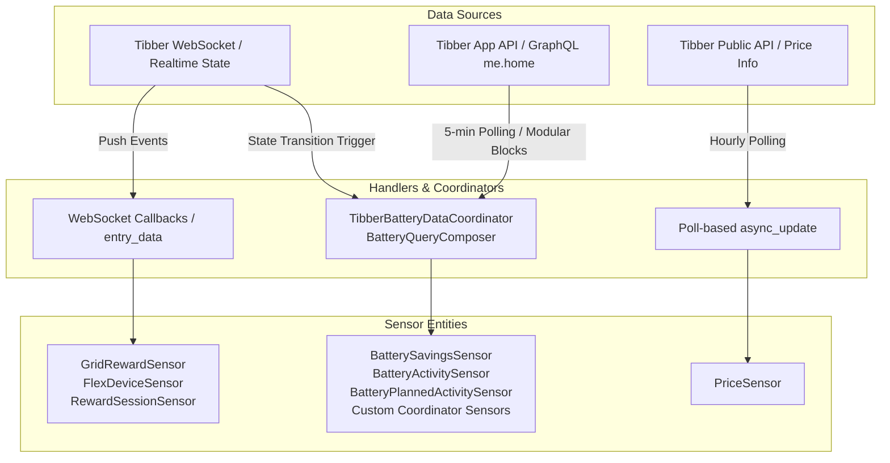

# Tibber Grid Reward

This is a custom integration for Home Assistant that allows you to monitor and interact with the Tibber Grid Reward program.

[](https://my.home-assistant.io/redirect/hacs_repository/?owner=JohNan&repository=homeassistant-tibber_grid_rewards&category=integration)

## Features

- **Grid Reward Sensors**: Provides sensors for the current state of the grid reward, the reason for the current state, and the earnings for the current day and month.
- **Live Session Reward**: A sensor that shows the live, accumulating reward amount during an active grid reward session.
- **Battery Sensors (Consolidated Coordinator)**: For home batteries, coordinates all telemetry within a single consolidated GraphQL query via Home Assistant's `DataUpdateCoordinator`:
  - **Savings Sensors**: Total savings for today, this week, and this month (the figure the Tibber app displays as "Your total savings" on the battery screen).
  - **Activity Reason Sensor**: Explains current battery behavior and state transitions, distinguishing grid rewards (`HomeBatteryChargingForGridRewards`, `HomeBatteryDischargingForGridRewards`) from price arbitrage, solar charging, fuse protection, etc.
  - **Planned Activity Sensor**: Timestamp of the next scheduled charge/discharge event, with attributes containing the full quarter-hourly power flow and state-of-charge schedule through tomorrow.
- **Modular GraphQL Query Engine**: Extensible query block engine (`GraphQLQueryBlock` and `GraphQLQueryComposer` in `query_blocks.py`) allowing arbitrary telemetry and query fragments with custom response parsers to be added without modifying core polling or coordinator logic.
- **Flexible Device Sensors**: Provides sensors for the state and connectivity of your flexible devices (e.g., electric vehicles).
- **Departure Time Control**: Allows you to set the departure time for your electric vehicles directly from Home Assistant.

## Architecture & Adding New Sensors

The integration uses three distinct data ingestion patterns depending on the data source and update frequency:



### 1. Adding a Modular GraphQL Query Sensor (`CoordinatorEntity`)

For any data queried through the authenticated Tibber GraphQL endpoint, queries are composed modularly using `GraphQLQueryBlock` (or inline via `create_query_block`) and `GraphQLQueryComposer`.

Pre-made battery blocks (`BatterySavingsBlock`, `BatteryActivityBlock`, `BatteryPlannedBlock`) are standard query blocks registered into `GLOBAL_QUERY_BLOCK_REGISTRY` under `"savings"`, `"activity"`, and `"planned"`. They are treated identically to any custom or generic query block.

Blocks support configurable GraphQL root targets:
- `root_field = "me.home"`: Embedded inside `me { home(id: $homeId) { ... } }` (default).
- `root_field = "home"`: Embedded inside `home(id: $homeId) { ... }`.
- `root_field = "me"`: Embedded inside `me { ... }`.

#### Method 1: Subclass `GraphQLQueryBlock` (Structured Pattern)
Define a dedicated class specifying GraphQL variable definitions, variable evaluation, query fragments, and response parsing:

```python
from typing import Any
from custom_components.tibber_grid_reward.query_blocks import GraphQLQueryBlock


class BatteryHealthBlock(GraphQLQueryBlock):
    """Modular block for battery health and diagnostics."""

    name = "health"
    root_field = "me.home"

    def get_query_fragment(self) -> str:
        return """battery(id: $deviceId) {
  health {
    stateOfHealth
    cycleCount
  }
}"""

    def parse_response(self, home_data: dict[str, Any]) -> dict[str, Any]:
        battery = home_data.get("battery") or {}
        return battery.get("health") or {}
```

#### Method 2: Inline Factory `create_query_block()` (Lightweight Pattern)
Instantiate any block dynamically without subclassing:

```python
from custom_components.tibber_grid_reward.query_blocks import create_query_block

solar_block = create_query_block(
    name="solar_inverter",
    query_fragment="solar { currentPower totalEnergy }",
    parse_fn=lambda d: d.get("solar", {}).get("currentPower"),
)
```

#### Step B: Register the Block (Optional)
Register your block into `GLOBAL_QUERY_BLOCK_REGISTRY` to reference it anywhere by name:

```python
from custom_components.tibber_grid_reward.query_blocks import (
    GLOBAL_QUERY_BLOCK_REGISTRY,
)

GLOBAL_QUERY_BLOCK_REGISTRY.register(BatteryHealthBlock, "health")
GLOBAL_QUERY_BLOCK_REGISTRY.register(solar_block)
```

#### Step C: Execute Query Blocks

**Option 1: One-Off Single Block Execution**
```python
power = await api.execute_block(solar_block, home_id=home_id)
```

**Option 2: Composed Multi-Block Execution**
Pass block instances or registered string names directly:
```python
results = await api.execute_query_blocks(
    ["savings", "activity", solar_block], home_id=home_id, device_id=battery_id
)
# results["savings"], results["solar_inverter"] are parsed and accessible
```

**Option 3: Polling Coordinator (`TibberQueryDataCoordinator`)**
Bind blocks to a coordinator for periodic polling:
```python
coordinator = TibberQueryDataCoordinator(
    hass,
    api,
    home_id=home_id,
    device_id=battery_id,
    blocks=["savings", "activity", "planned", solar_block],
)
await coordinator.async_config_entry_first_refresh()
```

#### Step D: Create the Sensor Entity (`sensor.py`)
Subclass `CoordinatorEntity[TibberQueryDataCoordinator]` and read the parsed block data uniformly from `self.coordinator.data`:

```python
class BatteryCycleCountSensor(
    CoordinatorEntity[TibberQueryDataCoordinator], SensorEntity
):
    def __init__(self, coordinator, entry_id, device, description):
        super().__init__(coordinator)
        self.entity_description = description
        self._device_id = device["id"]
        self._attr_unique_id = f"{self._device_id}_cycle_count"

    @property
    def native_value(self):
        health = self.coordinator.data.get("health") or {}
        return health.get("cycleCount")
```

---

### 2. Adding a Real-Time / WebSocket Push Sensor

For sensors that update immediately upon receiving push payloads from Tibber's real-time WebSocket connection:

1. **Entity Base**: Subclass `SensorEntity` (or `GridRewardSensor` / `FlexDeviceSensor` in `sensor.py`).
2. **Implement `update_data(self, data)`**:
   ```python
   @callback
   def update_data(self, data: dict[str, Any]) -> None:
       self._attr_native_value = data.get("someField")
       self.async_write_ha_state()
   ```
3. **Dispatch Registration**: In `sensor.py` (`async_setup_entry`), register the entity in either:
   - `hass.data[DOMAIN][entry_id]["grid_reward_devices"]`: Receives updates whenever Grid Reward WebSocket messages arrive.
   - `hass.data[DOMAIN][entry_id]["vehicle_devices"][vehicle_id]`: Receives updates when vehicle state pushes arrive.

---

### 3. Adding a Public API / Standalone Polled Sensor

For sensors fetching third-party or unauthenticated data (like Tibber electricity prices via `TibberPublicAPI`):

1. **Implement `async_update(self)`**:
   ```python
   class MyPublicSensor(SensorEntity):
       async def async_update(self) -> None:
           data = await self._public_api.get_custom_data(self._home_id)
           self._attr_native_value = data.get("value")
   ```
2. **Registration**: Instantiate and add to `sensors` list in `async_setup_entry` in `sensor.py`. Home Assistant will periodically call `async_update`.


## Installation

### HACS (Recommended)

1. Add this repository as a custom repository in HACS.
2. Search for "Tibber Grid Reward" in HACS and install it.
3. Restart Home Assistant.
4. Add the "Tibber Grid Reward" integration from the Home Assistant UI.

### Manual Installation

1. Copy the `tibber_grid_reward` directory to your Home Assistant `custom_components` directory.
2. Restart Home Assistant.
3. Add the "Tibber Grid Reward" integration from the Home Assistant UI.

## Configuration

The integration is configured through the Home Assistant UI. You will need to provide:

- **Username and Password**: Your Tibber account credentials used to log into the Tibber mobile app.
- **API Key (Access Token)**: Used to fetch electricity prices and account data from the Tibber API. You can generate or retrieve your personal access token at [developer.tibber.com/settings/access-token](https://developer.tibber.com/settings/access-token) by logging in with your Tibber credentials.

## Services

### `tibber_grid_reward.set_departure_time`

Sets the departure time for a vehicle.

| Service Data | Description                                 |
|--------------|---------------------------------------------|
| `device_id`  | The device ID of the vehicle.               |
| `day`        | The day of the week (e.g., "monday").       |
| `time`       | The departure time in "HH:MM" format.       |

## Disclaimer

This integration is not developed, endorsed, or supported by Tibber. It is an unofficial, community-developed project.